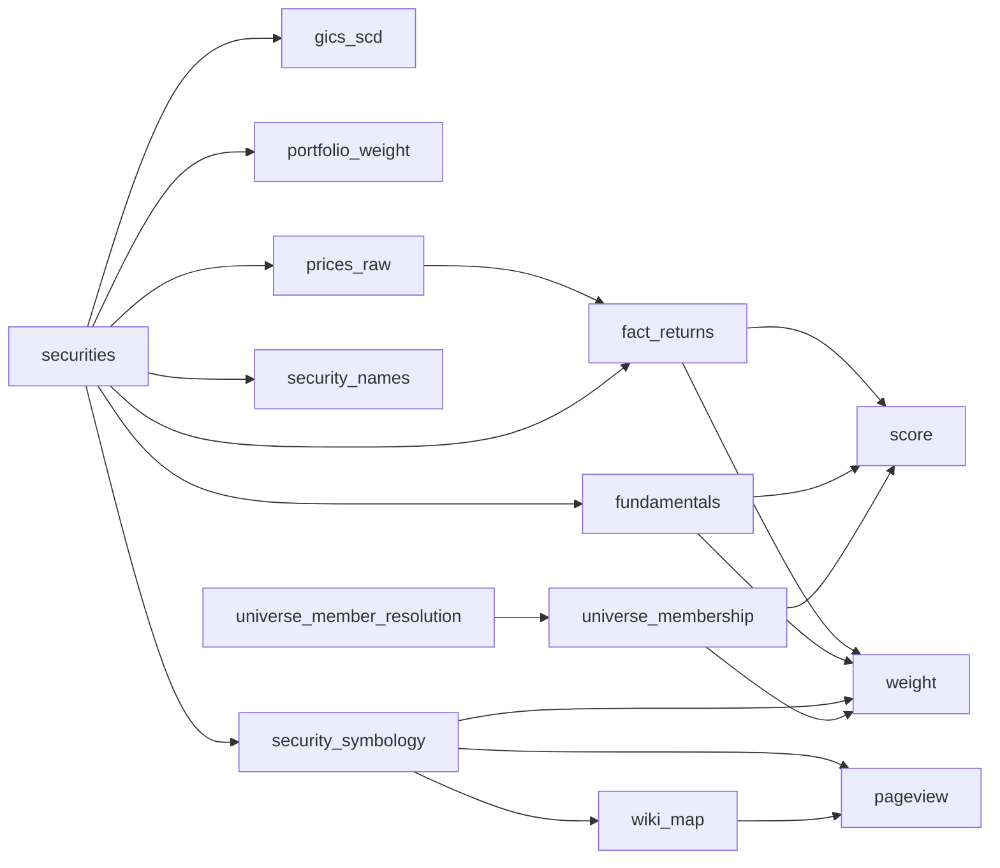
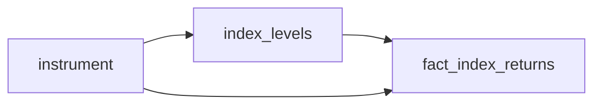

# QRP join-key field flow (generated)

_Auto-generated by `lineage.diagram` — the free substitute for the Dagster+ column-
lineage view. Each flowchart shows how a join key propagates across the tables that
carry it (edges = declared + auto-derived transform + FK referential). Regenerate with_
`uv run python -m lineage.diagram`.

> Note: only edges where **both** endpoints carry the key are shown — a transform that
> drops/renames the key terminates the flow, so absence of an edge here is not absence of
> lineage (see the full Dagster asset graph for that).

### `composite_figi` field flow

### `sym_id` field flow

